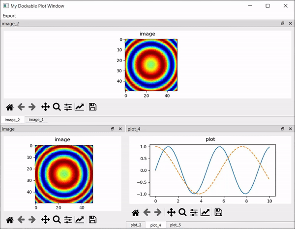

# Matplotlib-Qt-Visualization
A Python package providing enhanced data visualization and ROI selection built on top of Matplotlib and PyQt6

[Documentation](https://mpl-qt-viz.readthedocs.io/en/latest/)

# Installing
## Installing from the source code
This package can be installed in the same ways that most python packages installed. The easiest way is to use Pip:
Navigate to the root directory of this Git repository and run `pip install .`

## Installing from PyPi
`pip install mpl_qt_viz`

## Install with Conda
`conda install -c conda-forge mpl_qt_viz`

### Examples

#### Using the `PlotNd` widget to visualize hyperspectral imagery of a cancer cell

#### Using the `DockablePlotWindow` to help organize a large number of plots.

### Integrating `DockablePlotWindow` as a Pyplot backend
In order to have generic Pyplot code open a `DockablePlotWindow` for new figures add `matplotlib.use("module://mpl_qt_viz.backends.backend_dockableagg")`
prior to importing pyplot. See the example at "examples/dockableBackendExample.py"
