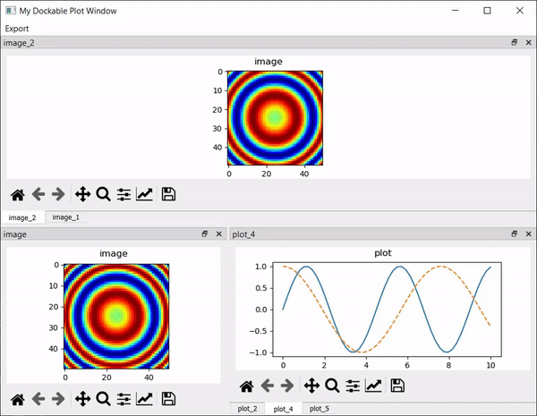

Module API
===============

:mod:`mpl_qt_viz`
----------------------

.. automodule:: mpl_qt_viz

Examples
===========
.. toctree::
    examples

Using the :class:`~mpl_qt_viz.visualizers.PlotNd` widget to visualize hyperspectral imagery of a cancer cell `PlotNd` widget to visualize hyperspectral imagery of a cancer cell.

.. image:: ../resources/plotNdCell.gif

Using the :class:`~mpl_qt_viz.visualizers.DockablePlotsWindow` to help organize a large number of plots.

Indices and tables
==================
* :ref:`genindex`
* :ref:`modindex`
* :ref:`search`